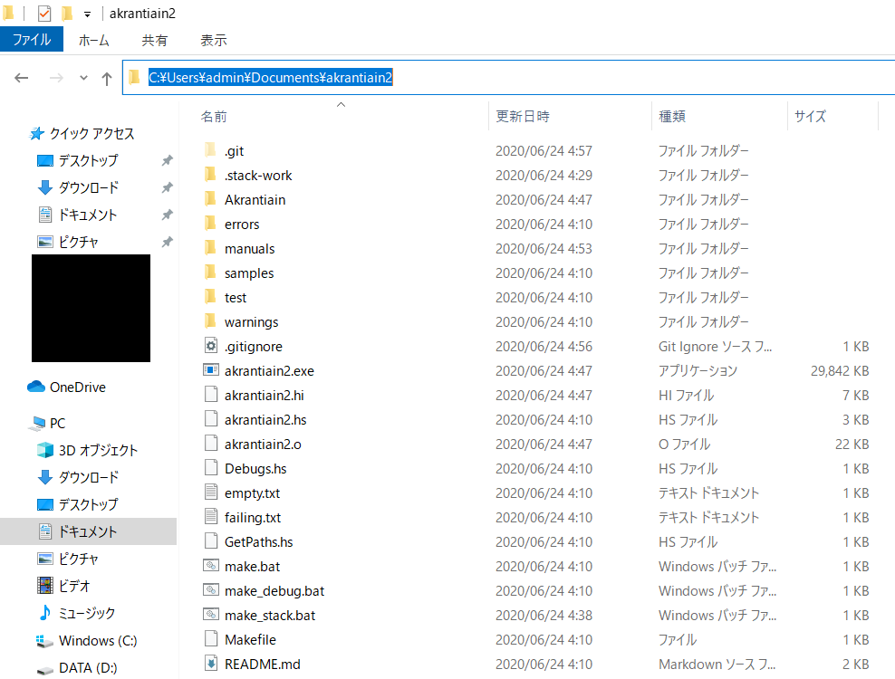

akrantiainで扱う全てのファイルはUTF-8である必要があります。

### インストール法

#### Windows (2020年6月24日に検証)
1. [ここ](https://docs.haskellstack.org/en/stable/README/) の 「Windows 64-bit Installer」の箇所をクリックしてインストール
2. コマンドプロンプトで `stack setup`
3. 待つ（40分ぐらい掛かるかもね）
4. `make_stack.bat`をダブルクリック
5. 出た窓で処理が完了したらEnterを押す
6. make_stack.bat をダブルクリックしたフォルダを開き、そこのアドレスバーに `cmd` と打ってコマンドプロンプトを立ち上げる



akrantiainを試用するには、その開いたコマンドプロンプト上で
```
echo lineparine | akrantiain2 samples\sample_lineparine.snoj
```
を実行してみましょう。

```
akrantiain2 samples\sample_lineparine.snoj
```
を実行するとインタラクティブに実行できます。([Ctrl+Z] -> [Enter] で終了できます)

ファイルから読むなら、
```
chcp 65001
akrantiain2 samples\sample_lineparine.snoj --file < samples\input_sample\input_sample_lineparine.txt
```
と実行することでできます。

注意: Windowsでは、入力に多バイト文字が含まれるときはインタラクティブ実行が動作しません。  
「ファイルから読み込む」モードでakrantiainを実行することで正しく動作します。

#### Ubuntu (16.04)
（未検証。[2017年8月版](installation_ja_obsolete.md) が多分動くと思うのでそのとおりにしていただきたい）

#### Mac
（未検証。[2017年8月版](installation_ja_obsolete.md) が多分動くと思うのでそのとおりにしていただきたい）
